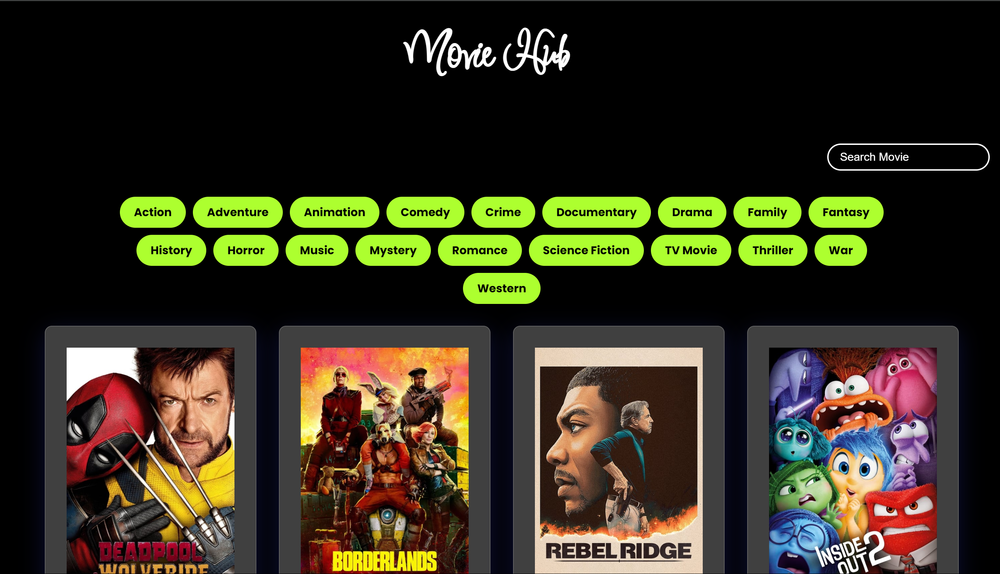
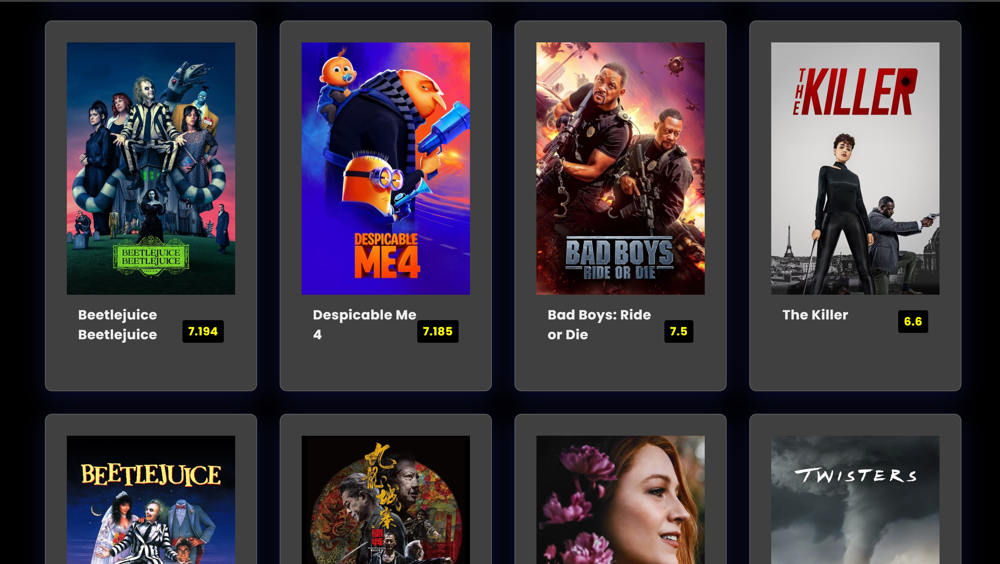
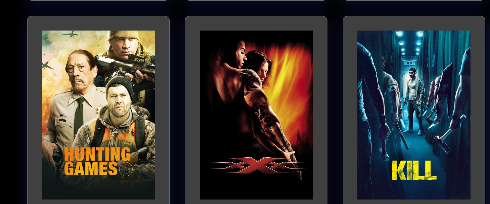
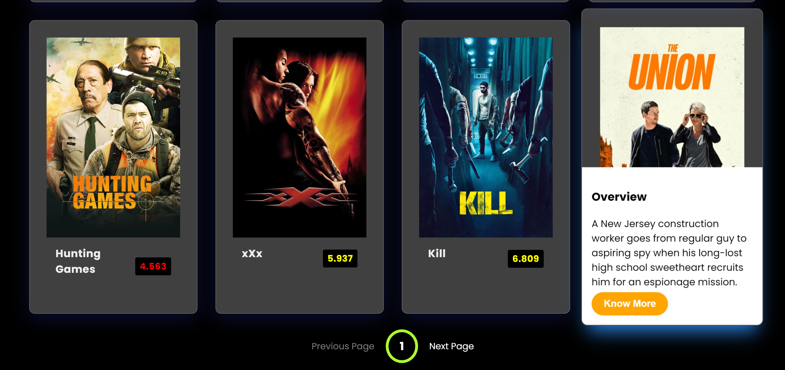
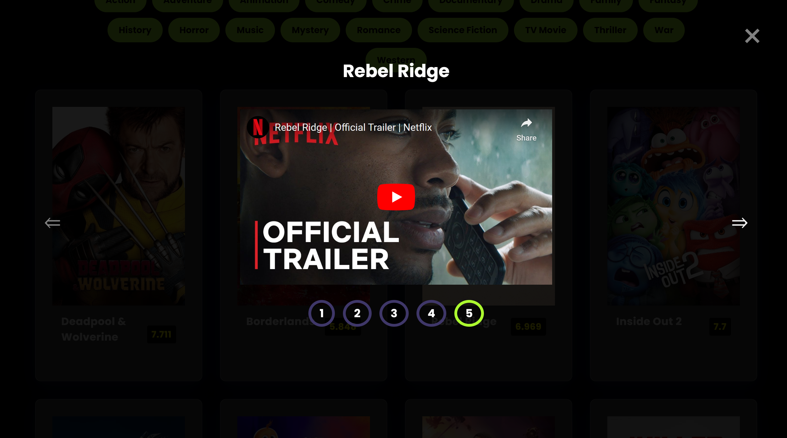
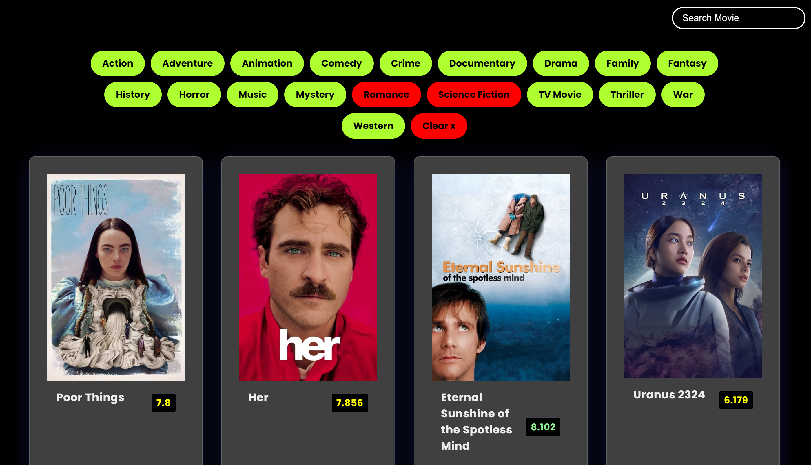

# 🎬 Movie Application



This project is a **Movie Application** where users can explore and find movies, view ratings, watch trailers, and browse related clips on YouTube. It fetches data from an external API, allowing real-time updates and information about the latest and most popular movies.

## 🌟 Features

- **Search for Movies:** Users can search for any movie by name or genre.
- **Movie Ratings & Reviews:** Get detailed ratings from multiple sources like IMDb, Rotten Tomatoes, etc.
- **Watch Trailers:** Embedded YouTube trailers of the selected movies.
- **Related Clips:** View related YouTube clips, interviews, and featurettes about the movie.
- **API Integration:** Dynamic data is fetched using an external movie API.



## 🛠️ Technologies Used

- **React.js:** Frontend framework for building user interfaces.
- **API Integration:** Fetch data from a third-party movie API (like TMDb or OMDb).
- **YouTube API:** Embed related clips and trailers directly from YouTube.
- **Styled Components:** For styling the UI elements.
- **Framer Motion:** To add animations and smooth transitions.
  


## 🎥 Application Pages

### 1. Home Page
- Displays trending and popular movies.
- Users can browse top-rated and upcoming movies.

### 2. Movie Details Page
- Provides detailed information about the selected movie.
- Ratings, synopsis, release date, and genre.
- Trailer section featuring an embedded YouTube video player.



### 3. Search Page
- Allows users to search for their favorite movies by title or genre.
- Displays real-time search results fetched from the API.



### 4. Related Clips
- View related clips and videos from YouTube, such as interviews or behind-the-scenes.
  


## 🚀 How to Run the Application

1. Clone the repository:
   ```bash
   git clone https://github.com/yourusername/movie-app.git
